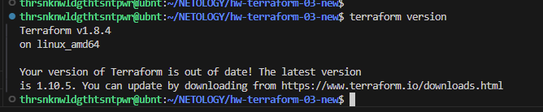

# Домашнее задание к занятию «Управляющие конструкции в коде Terraform»

### Цели задания

1. Отработать основные принципы и методы работы с управляющими конструкциями Terraform.
2. Освоить работу с шаблонизатором Terraform (Interpolation Syntax).

------

### Чек-лист готовности к домашнему заданию

1. Зарегистрирован аккаунт в Yandex Cloud. Использован промокод на грант.
2. Установлен инструмент Yandex CLI.
3. Доступен исходный код для выполнения задания в директории [**03/src**](https://github.com/netology-code/ter-homeworks/tree/main/03/src).
4. Любые ВМ, использованные при выполнении задания, должны быть прерываемыми, для экономии средств.

------

### Внимание!! Обязательно предоставляем на проверку получившийся код в виде ссылки на ваш github-репозиторий!
Убедитесь что ваша версия **Terraform** ~>1.8.4
  
Теперь пишем красивый код, хардкод значения не допустимы!
------

### Задание 1

1. Изучите проект.
2. Инициализируйте проект, выполните код. 

Приложите скриншот входящих правил «Группы безопасности» в ЛК Yandex Cloud .


------

### Задание 2

1. Создайте файл count-vm.tf. Опишите в нём создание двух **одинаковых** ВМ  web-1 и web-2 (не web-0 и web-1) с минимальными параметрами, используя мета-аргумент **count loop**. Назначьте ВМ созданную в первом задании группу безопасности.(как это сделать узнайте в документации провайдера yandex/compute_instance )


**`src/count-vm.tf`**
```
resource "yandex_compute_instance" "web" {
  depends_on = [ resource.yandex_compute_instance.db ]
  count = 2
  zone = var.default_zone
  name = "web-${count.index+1}"
  platform_id = var.vms.web.platform_id
  
  resources {
    cores = var.vms.web.cores
    memory = var.vms.web.ram
    core_fraction = var.vms.web.core_fraction
  }
  
  network_interface {
    subnet_id = yandex_vpc_subnet.develop.id
    nat = var.vms.web.nat
    security_group_ids = [ yandex_vpc_security_group.example.id ]
  }
  
  boot_disk {
    initialize_params {
      image_id = var.vms.web.image
    }
  }
  metadata = {
    serial-port-enable = 1
    ssh-keys           = "${local.local_admin}:${file(local.local_admin_public_key)}"
  }
}
```

2. Создайте файл for_each-vm.tf. Опишите в нём создание двух ВМ для баз данных с именами "main" и "replica" **разных** по cpu/ram/disk_volume , используя мета-аргумент **for_each loop**. Используйте для обеих ВМ одну общую переменную типа:
```
variable "each_vm" {
  type = list(object({  vm_name=string, cpu=number, ram=number, disk_volume=number }))
}
``` 


**`src/for_each-vm.tf`**
```
resource "yandex_compute_instance" "db" {
  for_each = { for hosts in var.each_vm : hosts.vm_name => hosts }
    name     = each.value.vm_name
    platform_id = each.value.platform_id
    resources {
      cores         = each.value.cpu
      memory        = each.value.ram
      core_fraction = each.value.core_fraction
    }
    boot_disk {
      initialize_params {
        image_id = each.value.image
        size = each.value.disk_volume
      }
    }
  scheduling_policy {
    preemptible = each.value.preemptible
  }
  network_interface {
    subnet_id = yandex_vpc_subnet.develop.id
    nat       = true
  }
  metadata = {
    serial-port-enable = 1
    ssh-keys           = "${local.local_admin}:${file(local.local_admin_public_key)}"
  }
}
```

3. При желании внесите в переменную все возможные параметры.

**`src/variables.tf`**
```
variable "each_vm" {
  type = list(object({
      vm_name = string
      cpu = number
      ram = number
      disk_volume = number
      core_fraction = number 
      image = string
      preemptible = bool
      platform_id = string
      nat = bool
    }))
    default = [
      {
      vm_name="main"
      cpu = 2
      ram = 2
      disk_volume = 10
      core_fraction = 5 
      image = "fd833v6c5tb0udvk4jo6"
      preemptible = "true"
      platform_id = "standard-v1"
      nat = true
    },
      {
      vm_name="replica"
      cpu = 2
      ram = 2
      disk_volume = 20
      core_fraction = 5 
      image = "fd833v6c5tb0udvk4jo6"
      preemptible = "true"
      platform_id = "standard-v1"
      nat = true
    }
  ]
}
```

4. ВМ из пункта 2.1 должны создаваться после создания ВМ из пункта 2.2.  
`depends_on = [ resource.yandex_compute_instance.db ]`

5. Используйте функцию file в local-переменной для считывания ключа ~/.ssh/id_rsa.pub и его последующего использования в блоке metadata, взятому из ДЗ 2.  
`ssh-keys           = "${local.local_admin}:${file(local.local_admin_public_key)}"`

6. Инициализируйте проект, выполните код.


------

### Задание 3

1. Создайте 3 одинаковых виртуальных диска размером 1 Гб с помощью ресурса yandex_compute_disk и мета-аргумента count в файле **disk_vm.tf** .
2. Создайте в том же файле **одиночную**(использовать count или for_each запрещено из-за задания №4) ВМ c именем "storage"  . Используйте блок **dynamic secondary_disk{..}** и мета-аргумент for_each для подключения созданных вами дополнительных дисков.

------

### Задание 4

1. В файле ansible.tf создайте inventory-файл для ansible.
Используйте функцию tepmplatefile и файл-шаблон для создания ansible inventory-файла из лекции.
Готовый код возьмите из демонстрации к лекции [**demonstration2**](https://github.com/netology-code/ter-homeworks/tree/main/03/demo).
Передайте в него в качестве переменных группы виртуальных машин из задания 2.1, 2.2 и 3.2, т. е. 5 ВМ.
2. Инвентарь должен содержать 3 группы и быть динамическим, т. е. обработать как группу из 2-х ВМ, так и 999 ВМ.
3. Добавьте в инвентарь переменную  [**fqdn**](https://cloud.yandex.ru/docs/compute/concepts/network#hostname).
``` 
[webservers]
web-1 ansible_host=<внешний ip-адрес> fqdn=<полное доменное имя виртуальной машины>
web-2 ansible_host=<внешний ip-адрес> fqdn=<полное доменное имя виртуальной машины>

[databases]
main ansible_host=<внешний ip-адрес> fqdn=<полное доменное имя виртуальной машины>
replica ansible_host<внешний ip-адрес> fqdn=<полное доменное имя виртуальной машины>

[storage]
storage ansible_host=<внешний ip-адрес> fqdn=<полное доменное имя виртуальной машины>
```
Пример fqdn: ```web1.ru-central1.internal```(в случае указания переменной hostname(не путать с переменной name)); ```fhm8k1oojmm5lie8i22a.auto.internal```(в случае отсутвия перменной hostname - автоматическая генерация имени,  зона изменяется на auto). нужную вам переменную найдите в документации провайдера или terraform console.
4. Выполните код. Приложите скриншот получившегося файла. 

Для общего зачёта создайте в вашем GitHub-репозитории новую ветку terraform-03. Закоммитьте в эту ветку свой финальный код проекта, пришлите ссылку на коммит.   
**Удалите все созданные ресурсы**.